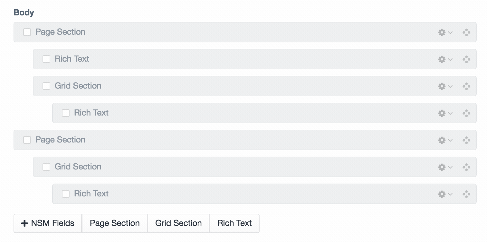

**Attention**: This plugin is super experimental. Don't use it in production

# NSM Publish Layout Helper for CraftCMS 3.x




The purpose of this plugin is to indent matrix blocks in order for them to appear as a tree.

Newism uses two layout blocks when creating art directed landing pages. They are:

* Page Section `pageSection`: The purpose of this block is to encapsulate it's "children" with a background colour, image etc.
* Grid Section `gridSection`: The purpose of this block is to layout it's "children" according to the grid settings of the block.

Given this plugin does not actually nest the matrix blocks some modifications to the twig template need to be implemented. Here's a simple example:

```
Coming Soon
```

## Credits

Brought to you by [Newism](http://newism.com.au)

[](http://newism.com.au/)
